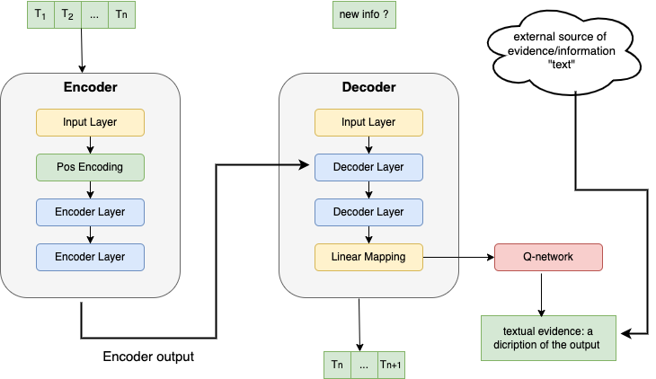

# 4CastWTransformer

 
The diagram illustrates the core architecture of the Transformer model specifically tailored for time series forecasting tasks. It consists of two main components:

## Encoder Layer:

Self-attention: This mechanism allows the model to weigh the importance of different inputs regardless of their sequence in the data. 
Add & Normalize: Helps in stabilizing the learning process by normalizing the output of the self-attention layer. 
Feed Forward: A fully connected layer that processes the output of the addition and normalization step. 
Add & Normalize: A second normalization step to refine the outputs for the decoder. 

## Decoder Layer:

Self-attention: Similar to the encoder, this allows the decoder to focus on relevant parts of the input data. 
Add & Normalize: Normalizes the data post self-attention in the decoder. 
Encoder-decoder Attention: This layer helps the decoder focus on relevant parts of the input sequence, enhanced by what the encoder has learned. 
Add & Normalize: Ensures smooth data flow into the feed forward layer. 
Feed Forward: Processes the outputs from the previous steps to generate the final output sequence. 
Add & Normalize: Final normalization step to ensure output stability. 

This architecture is designed to handle the complexities of sequence data inherent in time series forecasting, enabling effective learning and prediction of future values based on past data.

 